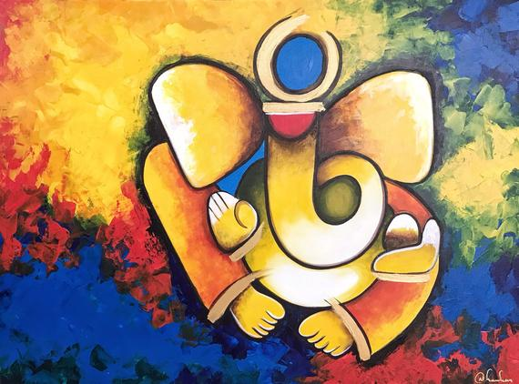
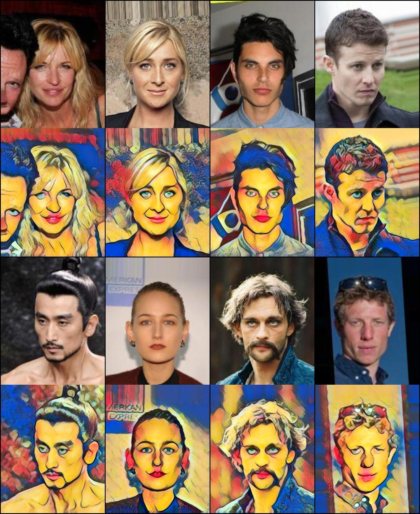

# Fast Neural Style Transfer

## Description:
   Fast Neural Style Transfer implementation using pytorch.
   Implementtion of [Perceptual Losses for Real-Time Style Transfer 
and Super-Resolution](https://cs.stanford.edu/people/jcjohns/eccv16/)

## Output:

## Training and Testing:
   - Train your neural style transfer using [fastNeuralStyleTransfer.ipynb](fastNeuralStyleTransfer.ipynb)
   - Real time output using [realTime.py](realTime.py)
   

## Credits:
   - Paper: [Perceptual Losses for Real-Time Style Transfer 
and Super-Resolution](https://cs.stanford.edu/people/jcjohns/eccv16/)
   - Implementation inspired from: [GitHub.com/eriklindernoren/Fast-Neural-Style-Transfer](https://github.com/eriklindernoren/Fast-Neural-Style-Transfer) 